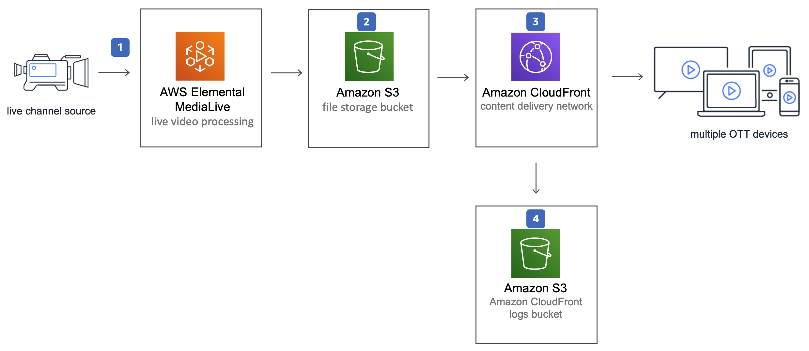

# Live Streaming on AWS with MediaStore

Live streaming on AWS with MediaStore automatically configures AWS Elemental MediaLive, AWS Elemental MediaStore and Amazon CloudFront to ingest, encode, package and deliver a single source live stream through the AWS Cloud. The Solution provides 3 Encoding profiles to support 1080p through 288p HTTP live streaming (HLS) outputs and an Amazon CloudFront Dashboard to monitor the ingress and egress requests to MediaStore. For more details see the [solution home page](https://aws.amazon.com/solutions/live-streaming-on-aws/). 

The solution was developed using the [AWS Cloud Development Kit]() and also leverages a AWS Solutions Construct [CloudFrontToMediaStore](tbc)

## On this Page
- [Architecture Overview](#architecture-overview)
- [Encoding Profiles](#encoding-profiles)
- [CloudWatch Dashboard](#cloudwatch-dashboard)
- [Requirements](#requirements)
- [Deployment](#deployment)
- [Creating a custom Build](#creating-a-custom-build)
- [License](#license)

## Architecture Overview


## Input Options
The solution supports RTP Push, RTMP push, HLS and [AWS Elemental Link](https://aws.amazon.com/medialive/features/link/) input types. For more detialed instructions see the Implementation Guid on the [solution home page](https://aws.amazon.com/solutions/live-streaming-on-aws/). 

## Encoding Profiles:

* HD-1080p profile: 1920x1080, 1280x720, 960x540, 768x432, 640x360, 512x288
* HD-720p profile: 1280x720, 960x540, 768x432, 640x360, 512x288
* SD-540p profile:  960x540, 768x432, 640x360, 512x288

## CloudWatch Dashboard
The solution includes an Amazon CloudWatch Dashboard that is configured to monitor the following MediaStore data points captured in Amazon CloudWatch Logs:

* Ingress TPM (Transaction Per Minute)
* Egress TPM (Transaction Per Minute)
* Put Object Latencies (Successful Requests)
* Get Object Latencies (Successful Requests)
* Ingress 2xx Status Count by Operation
* Ingress 4xx Status Count by Operation
* Ingress 5xx Status Count by Operation
* Egress 2xx Status Count by Operation
* Egress 4xx Status Count by Operation
* Egress 5xx Status Count by Operation


## Requirements:
Before you launch the solution, you must create a MediaStore IAM Role and associated policy to allow MediaStore access to Amazon CloudWatch. The solution will launch successfully but without this Role the Amazon CloudWatch Dashboard deployed as part of the solution will not work. This is a one-time requirement, once created the role will authorize logging for all MediaStore Containers (if enabled). For details please see the [MediaStore documentation](https://docs.aws.amazon.com/mediastore/latest/ug/incident-response.html)

## Deployment
The solution can be deployed through the CloudFormation template available on the [solution home page](https://aws.amazon.com/solutions/live-streaming-on-aws/). 

## Creating a custom build

### Prerequisites:
* [AWS Command Line Interface](https://aws.amazon.com/cli/)
* Node.js 12.x or later
* AWS CDK 1.73.0

The are 2 options for deploying the solution: using the CDK deployment tools or running the build script to generate a CFN template and the packaged lambda code.

### Options 1: Deploying through the CDK.
This options simply flollows the standard CDK deployment process, for easy of use we have included the deployment/build-cdk-deploy.sh BASH script that will run the lambda unit tests, run the cdk unit tests and then run `cdk deploy` in the source/cdk folder. You will need to run `cdk bootstrap` before you run cdk deply the first time to setup the cdk resource in your AWS account. Details on using the CDK can be found [here].

1. Download or clone the repo and make the required changes to the source code.
2. installl the dependecies for the lambda function and construct.
3. then run `cdk deploy` (first time use you will need to run `cdk bootstrap` first)

```
cd ./source/custom-resource
npm install --production
cd ../constructs
npm install 
cdk bootstrap //if you havent already done so.
cdk deploy
```

### Option 2: Generate a CloudFormation template.
The CloudFormation template (generated by the CDK) includes a lambda backed custom resource to configure MediaLive and create a UUID. To launch the solution the Lambda source code has to be deployed to an Amazon S3 bucket in the region you intend to deploy the solution. 

### 1. Clone the repo
Download or clone the repo and make the required changes to the source code.

### 2. Running unit tests for customization
Run unit tests to make sure added customization passes the tests:
```
cd ./deployment
chmod +x ./run-unit-tests.sh && ./run-unit-tests.sh
```

### 3. Create an Amazon S3 Bucket
The CloudFormation template is configured to pull the Lambda deployment packages from Amazon S3 bucket in the region the template is being launched in. Create a bucket in the desired region with the region name appended to the name of the bucket. eg: for us-east-1 create a bucket named: `my-bucket-us-east-1`
```
aws s3 mb s3://my-bucket-us-east-1
```

### 4. Create the deployment packages
Build the distributable:
```
chmod +x ./build-s3-dist.sh
./build-s3-dist.sh <bucketnsme> live-streaming-on-aws-with-mediastore <version>
```

> **Notes**: The _build-s3-dist_ script expects the bucket name as one of its parameters, and this value should not include the region suffix

Deploy the distributable to the Amazon S3 bucket in your account:
```
aws s3 sync ./regional-s3-assets/ s3://my-bucket-us-east-1/live-streaming-on-aws-with-mediastore/<version>/ --acl public-read
aws s3 sync ./global-s3-assets/ s3://my-bucket-us-east-1/live-streaming-on-aws-with-mediastore/<version>/ --acl public-read
```

### 5. Launch the CloudFormation template.
* Get the link of the live-streaming-on-aws-with-mediastore.template uploaded to your Amazon S3 bucket.
* Deploy the solution.

## License

* This project is licensed under the terms of the Apache 2.0 license. See `LICENSE`.


